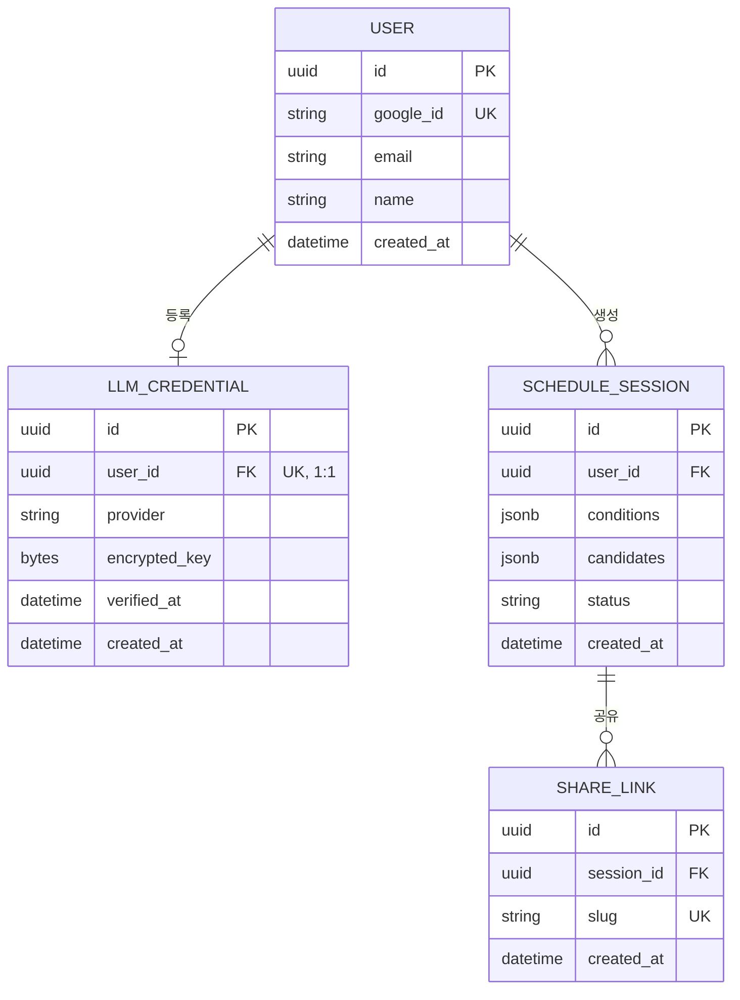

# 개인화된 만남 일정 추천 웹 서비스 — ERD / 테이블 명세서

| | |
|---|---|
| **날짜** | 2026-08-06 |
| **DB** | Postgres (개발 환경은 `moduyaksok-db/docker-compose.yml`로 로컬 컨테이너 실행) |

---

## 1. ERD

---

## 2. 테이블 명세서

### 2.1 `user`
로그인 사용자. Google OAuth로만 가입되며 비밀번호를 저장하지 않는다.

| 컬럼 | 타입 | 제약 | 설명 |
|---|---|---|---|
| id | UUID | PK | |
| google_id | VARCHAR | UNIQUE, NOT NULL, INDEX | Google이 발급하는 고유 사용자 ID (`sub` 클레임) |
| email | VARCHAR | NOT NULL | |
| name | VARCHAR | NULL | Google 프로필 이름 |
| created_at | TIMESTAMP | NOT NULL, DEFAULT now() | |

### 2.2 `llm_credential`
사용자가 등록한 LLM API 키 (BYOK). 사용자당 1개, 등록 시 제공자를 선택해야 한다.

| 컬럼 | 타입 | 제약 | 설명 |
|---|---|---|---|
| id | UUID | PK | |
| user_id | UUID | FK → user.id, UNIQUE, NOT NULL | 1인당 1개 키 |
| provider | VARCHAR | NOT NULL | `anthropic` \| `openai` — 사용자가 등록 화면에서 선택 |
| encrypted_key | BYTEA | NOT NULL | Fernet 대칭키로 암호화된 API 키. 평문 저장 금지 |
| verified_at | TIMESTAMP | NULL | 등록 시 유효성 검증(ping) 성공 시각 |
| created_at | TIMESTAMP | NOT NULL, DEFAULT now() | |

### 2.3 `schedule_session`
사용자가 조건을 입력해 생성한 일정 1건. 후보 3개와 최종 확정 상태를 함께 가짐.

| 컬럼 | 타입 | 제약 | 설명 |
|---|---|---|---|
| id | UUID | PK | |
| user_id | UUID | FK → user.id, NOT NULL | |
| conditions | JSONB | NOT NULL | 사용자가 보낸 원본 조건 |
| normalized_conditions | JSONB | NOT NULL | 최초 Step1 결과. 필수 장소 재생성 때 Step1을 다시 호출하지 않고 동일 조건을 재사용 |
| candidates | JSONB | NOT NULL | `ScheduleResponse` 직렬화 (후보 3안 전체) |
| status | VARCHAR | NOT NULL, DEFAULT 'draft', CHECK (status IN ('draft','confirmed')) | `draft` \| `confirmed` |
| created_at | TIMESTAMP | NOT NULL, DEFAULT now() | |

> `conditions`/`candidates`를 JSONB 컬럼으로 두는 이유: 파이프라인 출력 스키마가 초기에 자주 바뀌는 시기라 마이그레이션 없이 대응하기 위함. 스키마가 안정되면 활동/장소를 별도 정규화 테이블(`schedule_activity` 등)로 분리하는 걸 검토.

### 2.4 `schedule_place_pool` (2026-08-11(2차) 신규)
`schedule_session` 하나가 생성될 때 검색된 네이버 지역검색 결과(place_candidates)와
이미 검색한 verifiable 태그 목록을 저장. 나중에 피드백으로 일정을 수정할 때 이미
검색한 태그는 네이버 API를 다시 안 부르고, 새로 등장한 태그만 추가 검색해 이 풀에
누적시키기 위한 캐시 성격의 테이블(피드백 엔드포인트 자체는 아직 미구현 — 지금은
저장만 함).

| 컬럼 | 타입 | 제약 | 설명 |
|---|---|---|---|
| id | UUID | PK | |
| session_id | UUID | FK → schedule_session.id, UNIQUE, NOT NULL | 1:1 — 세션 하나당 풀 하나 |
| places | JSONB | NOT NULL | 누적된 place_candidates 목록 |
| searched_liked_tags | JSONB | NOT NULL | 지금까지 검색을 호출한 verifiable liked 태그 |
| searched_disliked_tags | JSONB | NOT NULL | 지금까지 검색을 호출한 verifiable disliked 태그 |
| updated_at | TIMESTAMP | NOT NULL, DEFAULT now() | 피드백마다 갱신될 값 |

> `schedule_session`의 컬럼으로 얹지 않고 별도 테이블로 분리한 이유: `schedule_session`
> (status/confirmed_candidate_id 등)은 확정 시점에만 바뀌는 핵심 엔티티라 조회
> 빈도가 높은데(공유 화면, 목록 등), `places`는 피드백마다 갱신되고 API 응답에는
> 전혀 노출되지 않는 내부 상태라 같은 row에 두면 자주 읽히는 경로가 매번 필요
> 없는 큰 JSONB 블록을 같이 들고 다니게 된다(정규화 논의, 사용자 지적으로 컬럼
> 추가 안에서 별도 테이블로 전환).

### 2.5 `schedule_required_place` (2026-08-12 신규)
후보 목록에서 사용자가 "일정에 추가하기"로 고른 장소. 후보 풀의 단순 항목이 아니라
다음 재생성 결과에 반드시 포함돼야 하는 하드 제약이다. 선택 시점의 표시 스냅샷도
같이 저장하므로, 검색 풀을 나중에 누적해도 사용자는 자신이 고정한 장소를 확인·해제할
수 있다.

| 컬럼 | 타입 | 제약 | 설명 |
|---|---|---|---|
| id | UUID | PK | |
| session_id | UUID | FK → schedule_session.id, NOT NULL | |
| place_id | VARCHAR | NOT NULL, INDEX, UNIQUE(session_id, place_id) | 이름+도로명 주소에서 만든 결정론적 식별자 |
| name | VARCHAR | NOT NULL | 선택 당시 장소명 |
| category | VARCHAR | NOT NULL | 선택 당시 카테고리 |
| address | VARCHAR | NOT NULL | 선택 당시 주소 |
| map_url | VARCHAR | NOT NULL | 선택 당시 지도 링크 |
| created_at | TIMESTAMP | NOT NULL, DEFAULT now() | |

### 2.6 `share_link`
공개 공유용 링크. 로그인 없이 열람 가능해야 하므로 인증 정보와 완전히 분리된 테이블.

| 컬럼 | 타입 | 제약 | 설명 |
|---|---|---|---|
| id | UUID | PK | |
| session_id | UUID | FK → schedule_session.id, NOT NULL | |
| slug | VARCHAR | UNIQUE, NOT NULL, INDEX | URL에 노출되는 짧은 랜덤 문자열 (예: 8자 base62) |
| created_at | TIMESTAMP | NOT NULL, DEFAULT now() | |

---

## 3. 설계 메모
- 소프트 삭제(soft delete)는 두지 않음 — 삭제 요구사항이 아직 없어 컬럼만 늘리는 셈. 필요해지면 `deleted_at` 추가.
- `schedule_session.status`를 Postgres ENUM 타입 대신 문자열 + CHECK 제약(`ck_schedule_session_status`)으로 둔 이유: ENUM은 값 추가할 때마다 타입 자체를 ALTER해야 해서 마이그레이션이 더 무거움, CHECK 제약이면 문자열 컬럼 그대로 값만 제한 가능. (당초 "앱 코드 Pydantic Literal이 이미 막아준다"고 적었었는데, 이 프로젝트가 쓰는 SQLModel 버전은 `table=True` 모델 컬럼에 `Literal` 타입을 못 붙여서 — 시도하면 매핑 에러 남 — 그 가정이 틀렸음. 그래서 DB CHECK 제약으로 대체.)
- `draft → confirmed` 전이는 한 방향만 허용 (역방향 없음). DB 제약은 "이 두 값만 허용"까지만 보장하고, "이미 confirmed인 걸 다시 confirm 못 하게" 같은 전이 규칙은 `POST /schedules/{id}/confirm` 라우터 로직에서 막을 것 (아직 라우터 미구현).
- 인덱스는 FK 컬럼과 조회에 쓰이는 `google_id`, `slug`에만 최소로 배치.
