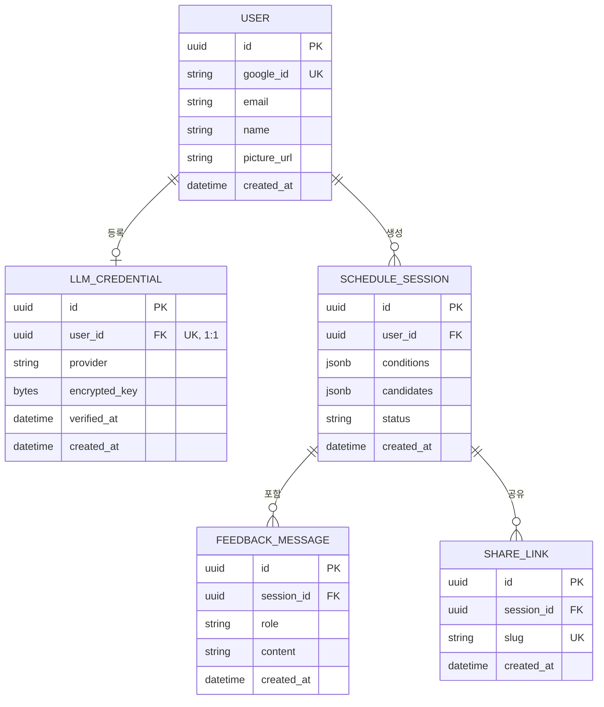

# 개인화된 만남 일정 추천 웹 서비스 — ERD / 테이블 명세서

| | |
|---|---|
| **날짜** | 2026-08-06 |
| **DB** | Postgres (개발 환경은 `db/docker-compose.yml`로 로컬 컨테이너 실행) |

---

## 1. ERD

---

## 2. 테이블 명세서

### 2.1 `user`
로그인 사용자. Google OAuth로만 가입되며 비밀번호를 저장하지 않는다.

| 컬럼 | 타입 | 제약 | 설명 |
|---|---|---|---|
| id | UUID | PK | |
| google_id | VARCHAR | UNIQUE, NOT NULL, INDEX | Google이 발급하는 고유 사용자 ID (`sub` 클레임) |
| email | VARCHAR | NOT NULL | |
| name | VARCHAR | NULL | Google 프로필 이름 |
| picture_url | VARCHAR | NULL | Google 프로필 이미지 |
| created_at | TIMESTAMP | NOT NULL, DEFAULT now() | |

### 2.2 `llm_credential`
사용자가 등록한 LLM API 키 (BYOK). 사용자당 1개, 등록 시 제공자를 선택해야 한다.

| 컬럼 | 타입 | 제약 | 설명 |
|---|---|---|---|
| id | UUID | PK | |
| user_id | UUID | FK → user.id, UNIQUE, NOT NULL | 1인당 1개 키 |
| provider | VARCHAR | NOT NULL | `anthropic` \| `openai` — 사용자가 등록 화면에서 선택 |
| encrypted_key | BYTEA | NOT NULL | Fernet 대칭키로 암호화된 API 키. 평문 저장 금지 |
| verified_at | TIMESTAMP | NULL | 등록 시 유효성 검증(ping) 성공 시각 |
| created_at | TIMESTAMP | NOT NULL, DEFAULT now() | |

### 2.3 `schedule_session`
사용자가 조건을 입력해 생성한 일정 1건. 후보 3개와 최종 확정 상태를 함께 가짐.

| 컬럼 | 타입 | 제약 | 설명 |
|---|---|---|---|
| id | UUID | PK | |
| user_id | UUID | FK → user.id, NOT NULL | |
| conditions | JSONB | NOT NULL | `NormalizedConditions` 직렬화 (목적/인원/시간/지역/선호/예산) |
| candidates | JSONB | NOT NULL | `ScheduleResponse` 직렬화 (후보 3안 전체) |
| status | VARCHAR | NOT NULL, DEFAULT 'draft' | `draft` \| `confirmed` |
| created_at | TIMESTAMP | NOT NULL, DEFAULT now() | |

> `conditions`/`candidates`를 JSONB 컬럼으로 두는 이유: 파이프라인 출력 스키마가 초기에 자주 바뀌는 시기라 마이그레이션 없이 대응하기 위함. 스키마가 안정되면 활동/장소를 별도 정규화 테이블(`schedule_activity` 등)로 분리하는 걸 검토.

### 2.4 `feedback_message`
일정 수정 대화 이력 (사용자 피드백 + 시스템 응답 로그).

| 컬럼 | 타입 | 제약 | 설명 |
|---|---|---|---|
| id | UUID | PK | |
| session_id | UUID | FK → schedule_session.id, NOT NULL | |
| role | VARCHAR | NOT NULL | `user` \| `system` |
| content | TEXT | NOT NULL | |
| created_at | TIMESTAMP | NOT NULL, DEFAULT now() | |

### 2.5 `share_link`
공개 공유용 링크. 로그인 없이 열람 가능해야 하므로 인증 정보와 완전히 분리된 테이블.

| 컬럼 | 타입 | 제약 | 설명 |
|---|---|---|---|
| id | UUID | PK | |
| session_id | UUID | FK → schedule_session.id, NOT NULL | |
| slug | VARCHAR | UNIQUE, NOT NULL, INDEX | URL에 노출되는 짧은 랜덤 문자열 (예: 8자 base62) |
| created_at | TIMESTAMP | NOT NULL, DEFAULT now() | |

---

## 3. 설계 메모
- 소프트 삭제(soft delete)는 두지 않음 — 삭제 요구사항이 아직 없어 컬럼만 늘리는 셈. 필요해지면 `deleted_at` 추가.
- `schedule_session.status`를 ENUM 타입 대신 문자열로 둔 이유: 값 종류가 앱 코드(Pydantic `Literal`)에서 이미 제한되므로 DB 레벨 ENUM 마이그레이션 비용을 지금 감수할 이유가 없음.
- 인덱스는 FK 컬럼과 조회에 쓰이는 `google_id`, `slug`에만 최소로 배치.
