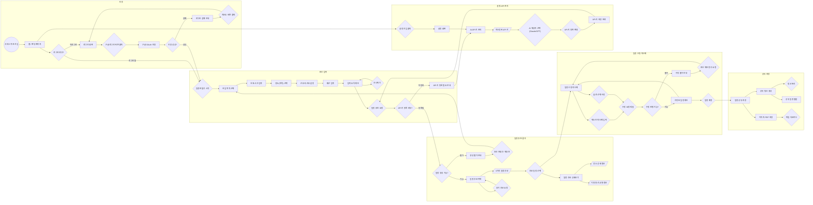

```mermaid
flowchart LR

  subgraph s1 ["인증"]
    n1(("서비스 최초 진입"))
    n2["홈 / 랜딩 페이지"]
    n3{"로그인 여부?"}
    n4["로그인 화면"]
    n5{"구글 로그인 버튼 클릭"}
    n6["구글 OAuth 인증"]
    n7{"인증 성공?"}
    n8["로그인 실패 안내"]
    n9{"재시도 버튼 클릭"}
  end

  subgraph s2 ["조건 입력"]
    n10{"일정 만들기 시작"}
    n11["만남 목적 선택"]
    n12["인원·시간 입력"]
    n13["장소(지역) 선택"]
    n14["선호·비선호 설정"]
    n15["예산 입력"]
    n16["입력 요약 확인"]
    n17{"건너뛰기"}
    n18{"일정 추천 요청"}
    n52{"API 키 등록 여부?"}
    n53["API 키 등록 필요 안내"]
  end

  subgraph s3 ["일정 추천 결과"]
    n19{"일정 생성 가능?"}
    n20["생성 불가 안내"]
    n21{"조건 완화 후 재추천"}
    n22["일정 후보 목록"]
    n23[/"3가지 일정 후보"/]
    n24{"후보 일정 선택"}
    n25["일정 후보 상세보기"]
    n26[/"장소 상세 정보"/]
    n27[/"이동 동선·교통 정보"/]
    n28{"추가 후보 요청"}
  end

  subgraph s4 ["일정 수정·피드백"]
    n29["일정 수정·피드백"]
    n30{"텍스트 피드백 입력"}
    n31{"옵션 선택 수정"}
    n32{"수정 요청 제출"}
    n33{"수정 반영 가능?"}
    n34["수정된 일정 확인"]
    n35["수정 불가 안내"]
    n36{"조건 재조정 후 요청"}
    n37{"일정 확정"}
  end

  subgraph s5 ["공유·저장"]
    n38["일정 공유·저장"]
    n39["공유 링크 생성"]
    n40{"링크 복사"}
    n41["공유 일정 열람"]
    n42["이미지·PDF 저장"]
    n43{"파일 다운로드"}
  end

  subgraph s6 ["설정·API 관리"]
    n44["설정 화면"]
    n45["AI API 키 관리"]
    n46[/"마스킹된 API 키"/]
    n54{"AI 제공자 선택 (Claude/GPT)"}
    n47{"API 키 등록·변경"}
    n48["API 키 저장 완료"]
    n51{"설정 진입 클릭"}
  end

  n1 --> n2
  n2 --> n3
  n3 -- "미로그인" --> n4
  n3 -- "로그인됨" --> n10
  n4 --> n5
  n5 --> n6
  n6 --> n7
  n7 -- "성공" --> n10
  n7 -- "실패" --> n8
  n8 --> n9
  n9 --> n4
  n10 --> n11
  n11 --> n12
  n12 --> n13
  n13 --> n14
  n14 --> n15
  n15 --> n16
  n16 --> n17
  n17 --> n16
  n16 --> n18
  n18 --> n52
  n52 -- "등록됨" --> n19
  n52 -- "미등록" --> n53
  n53 --> n45
  n19 -- "불가" --> n20
  n19 -- "가능" --> n22
  n20 --> n21
  n21 --> n11
  n22 --> n23
  n23 --> n24
  n24 --> n25
  n25 --> n26
  n25 --> n27
  n22 --> n28
  n28 --> n22
  n24 --> n29
  n29 --> n30
  n29 --> n31
  n30 --> n32
  n31 --> n32
  n32 --> n33
  n33 -- "가능" --> n34
  n33 -- "불가" --> n35
  n34 --> n29
  n34 --> n37
  n35 --> n36
  n36 --> n29
  n37 --> n38
  n38 --> n39
  n39 --> n40
  n39 --> n41
  n38 --> n42
  n42 --> n43
  n2 --> n51
  n51 --> n44
  n44 --> n45
  n45 --> n46
  n46 --> n54
  n54 --> n47
  n47 --> n48
  n48 --> n18
```
